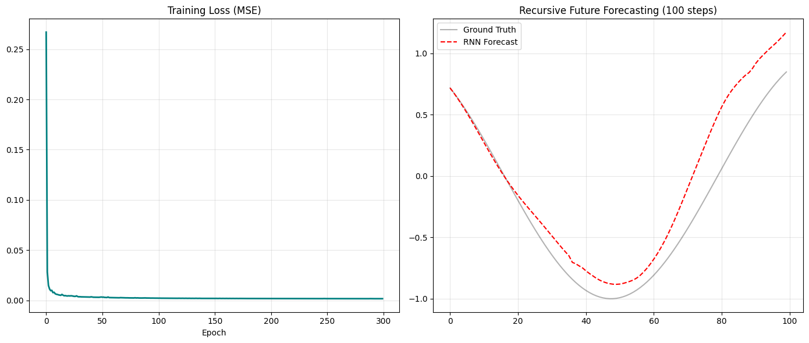

# Simple RNN in Python

This repository contains a simple implementation of a Recurrent Neural Network (RNN) in Python without using Tensorflow and Pytorch.
Here I have implmented it as sine wave predictor.

It's organized into two main scripts:

- `rnn.py`: Defines the RNN model and forward/backward propagation logic.
- `training.py`: Handles training the RNN on sample data.

## Getting Started

1. **Prerequisites**
   - Python 3.x
   - Libraries: `numpy` (install via `pip install numpy`)

2. **Running the code**
   ```sh
   python rnn.py
   python training.py
   ```

3. **Structure**
   - `rnn.py` - core RNN implementation
   - `training.py` - training loop and sample dataset
   - `output.png` - example training result (e.g. loss curve or generated output)

## Example Output



## Usage

Modify `training.py` to load your own data or adjust hyperparameters. The scripts are intended for educational purposes and demonstrate how a basic RNN functions without external frameworks.

## Further Reading

For a mathematical derivation and deeper explanation of the RNN equations used in this project, see my LinkedIn post:

[Understanding RNN Math](https://www.linkedin.com/in/your-profile/post/math-rnn-derivation)


